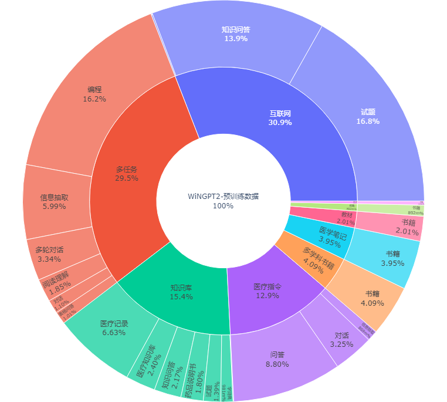
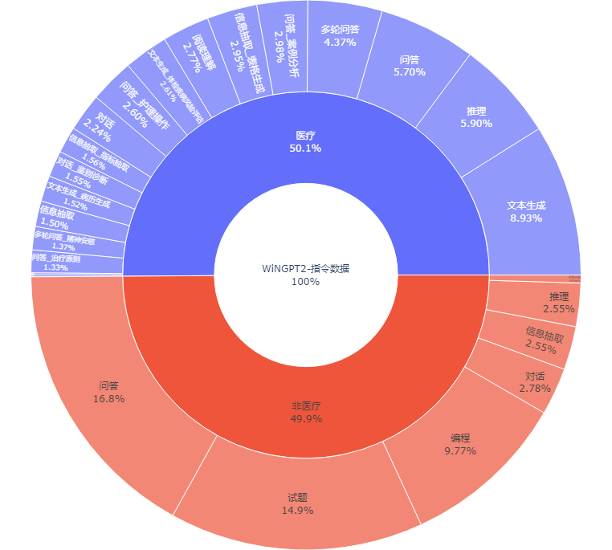
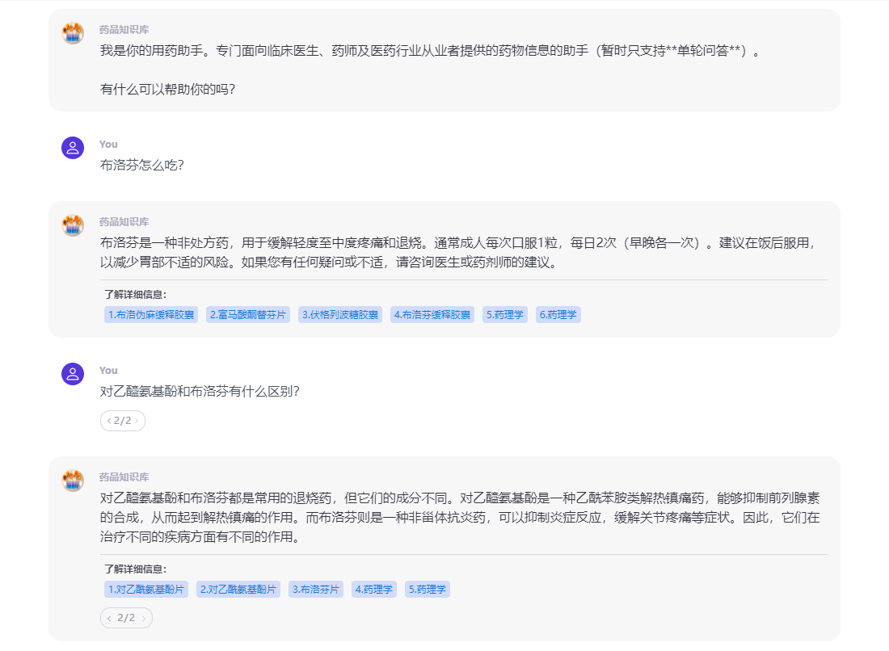
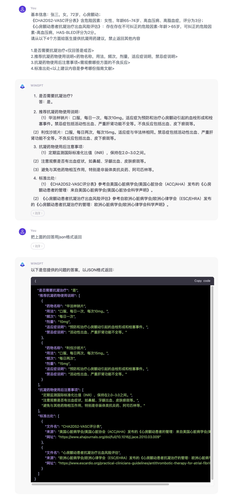
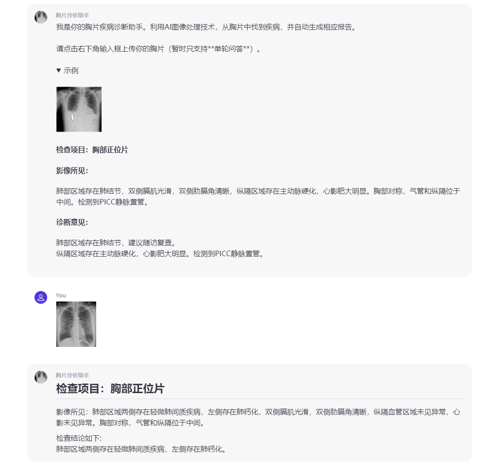

## WiNGPT2

WiNGPT是一个基于GPT的医疗垂直领域大模型，旨在将专业的医学知识、医疗信息、数据融会贯通，为医疗行业提供智能化的医疗问答、诊断支持和医学知识等信息服务，提高诊疗效率和医疗服务质量。

## 更新日志

[2023/12/12] 开源 WiNGPT2 与14B模型权重: [🤗](https://huggingface.co/winninghealth/WiNGPT2-14B-Base)WiNGPT2-14B-Base 和 [🤗](https://huggingface.co/winninghealth/WiNGPT2-14B-Chat)WiNGPT2-14B-Chat。 

[2023/11/02] [13B模型平台测试](https://wingpt.winning.com.cn/) 和 [欢迎加入微信讨论群](https://github.com/winninghealth/WiNGPT2/blob/main/assets/WiNGPT_GROUP.JPG)

[2023/10/13] 更新一个简单的[Chatbot示例](#部署)，可以进行简单的多轮对话。

[2023/09/26] 开源 WiNGPT2 与7B模型权重: [🤗](https://huggingface.co/winninghealth/WiNGPT2-7B-Base)WiNGPT2-7B-Base 和 [🤗](https://huggingface.co/winninghealth/WiNGPT2-7B-Chat)WiNGPT2-7B-Chat。 

## 目录

- [介绍](#介绍)
- [特点](#特点)
- [如何使用](#如何使用)
- [训练数据](#训练数据)
- [模型卡](#模型卡)
- [评测](#评测)
- [应用](#应用)
- [局限性与免责声明](#局限性与免责声明)
- [许可证](#许可证)
- [参考资料](#参考资料)
- [联系我们](#联系我们)

## 介绍

WiNGPT（卫宁健康医疗语言大模型，以下简称WiNGPT）的研发和训练工作开始于2023年1月。

3月，卫宁健康人工智能实验室已完成了WiNGPT1可行性验证并开始内测。WiNGPT1采用通用的GPT架构、62亿参数，实现了从预训练到微调的全过程自研。

今年5月，WiNGPT1训练的数据量已达到9720项药品知识、 18个药品类型、7200余项疾病知识、 2800余项检查检验知识、53本书籍知识、1100余份指南文档，总训练Token数达37亿。

7月，WiNGPT升级到7B并采用最新的模型架构，新增检索式增强生成能力，同时开始了13B模型的训练和行业邀测。

9月，WiNGPT迎来最新版本迭代，推出了全新的WiNGPT2，新版本可以被轻松扩展和个性化并用于下游各种应用场景。

为了回馈开源社区我们尝试开源了WiNGPT2-7B版本。我们的初衷是希望通过更多的开源项目加速医疗语言大模型技术与行业的共同发展，最终惠及我们人类健康。


## 特点

- 核心功能

  - **医学知识问答**：可以回答关于医学、健康、疾病等方面的问题，包括但不限于症状、治疗、药物、预防、检查等。
  - **自然语言理解**：理解医学术语、病历等医疗文本信息，提供关键信息抽取和归类
  - **多轮对话**：可扮演各种医疗专业角色如医生与用户进行对话，根据上下文提供更加准确的答案。
  - **多任务支持**：支持32项医疗任务，八大医疗场景18个子场景。

- 模型架构

  - 基于Transformer的70亿参数规模大语言模型, 采用RoPE相对位置编码、SwiGLU激活函数、RMSNorm，训练采用Qwen-7b<sup>1</sup>作为基础预训练模型。

- 主要特点

  - 高准确度：基于大规模医疗语料库训练，具有较高的准确率和较低的误诊可能性。
  - 场景导向：针对不同的医疗场景和真实需求进行专门优化和定制，更好的服务应用落地。
  - 迭代优化：持续搜集和学习最新的医学研究，不断提高模型性能和系统功能。

## 如何使用

### 下载

🤗下载地址：

[WiNGPT2-7B-Base](https://huggingface.co/winninghealth/WiNGPT2-7B-Base)

[WiNGPT2-7B-Chat](https://huggingface.co/winninghealth/WiNGPT2-7B-Chat)

[WiNGPT2-14B-Base](https://huggingface.co/winninghealth/WiNGPT2-14B-Base)

[WiNGPT2-14B-Chat](https://huggingface.co/winninghealth/WiNGPT2-14B-Chat)

### 推理

```python
from transformers import AutoModelForCausalLM, AutoTokenizer

model_path = "WiNGPT2-7B-Chat"
device = "cuda"

tokenizer = AutoTokenizer.from_pretrained(model_path, trust_remote_code=True)
model = AutoModelForCausalLM.from_pretrained(model_path, trust_remote_code=True).to(device)
model = model.eval()


text = 'User: WiNGPT, 你好<|endoftext|>\n Assistant:'
inputs = tokenizer.encode(text, return_tensors="pt").to(device)
outputs = model.generate(inputs, repetition_penalty=1.1, max_new_tokens=1024)
response = tokenizer.decode(outputs[0])
print(response)

## 输出结果：你好！今天我能为你做些什么？<|endoftext|>
```

### 提示

WiNGPT2-7B-Chat使用了自定义的提示格式：

用户角色：User/Assistant

提示模板：User:[此处有空格]WiNGPT, 你好<|endoftext|>\n[此处有空格]Assistant:；**多轮对话**按此模板进行拼接，例如：
```
"User: WiNGPT, 你好<|endoftext|>\n Assistant:你好！今天我能为你做些什么？<|endoftext|>\n User: 你是谁？<|endoftext|>\n Assistant:"
```

解码时推荐使用repetition_penalty=1.1 [greedy search]

### 部署

简单的chatbot部署示例：

```
python demo.py
```
注意：需要安装gradio

### 企业服务

联系我们获取邀测密钥

## 训练数据

- 数据总览

  - <details><summary>总数据量：预训练数据约20G，指令数据约50万条，数据分布情况如下图所示。</summary></br>&nbsp; </details>

  - 医疗专业数据

    | 来源             | 类型   | 数量                |
    | ---------------- | ------ | ------------------- |
    | 药品说明书       | 知识库 | 15000 条            |
    | 多病种知识库     | 知识库 | 9720 项             |
    | 医疗专业书籍     | 教材   | 300 本              |
    | 临床路径知识库   | 知识库 | 1400 条             |
    | 检查检验知识     | 知识库 | 110 万条            |
    | 多学科临床指南   | 书籍   | 18 个科室共 1100 份 |
    | 医疗知识图谱     | 知识库 | 256 万三元组        |
    | 人工标注数据集   | 指令   | 5 万条              |
    | 医学资格考试试题 | 试题   | 30 万条             |
    | 医疗病例、报告   | 知识库 | 100 万条            |

  - 其他公开数据

    | 来源                 | 类型   | 数量     |
    | -------------------- | ------ | -------- |
    | 医学科普书籍         | 书籍   | 500 本   |
    | 其他多学科书籍       | 书籍   | 1000 本  |
    | 代码                 | 指令   | 20 万条  |
    | 通用类试题           | 试题   | 300 万条 |
    | 多种自然语言处理任务 | 指令   | 90 万条  |
    | 互联网文本           | 互联网 | 300 万条 |
    | 医疗问答、对话       | 指令   | 500 万条 |

- 继续预训练

  - 扩充模型的医疗知识库：预训练数据+部分指令数据。

- 指令微调

  - 从书籍、指南、病例、医疗报告、知识图谱等数据中自动化构建医疗指令集。
  - 人工标注指令集，数据来源包括：电子病历系统、护理病历系统、PACS系统、临床科研系统、手术管理系统、公共卫生场景、医务管理场景以及工具助手场景。
  - 采用 FastChat<sup>2</sup>、Self-Instruct<sup>3</sup>、Evol-Instruct<sup>4</sup> 等方案，对指令集进行扩展以及丰富指令集多样化形式。

- 数据工程

  - 数据分类：根据训练阶段和任务场景进行分类。
  - 数据清洗：去除无关信息，更正数据中的拼写错误，提取关键信息以及去隐私处理。
  - 数据去重：采用 embedding 方法剔除重复数据。
  - 数据采样：根据数据集的质量与分布需求进行有针对性的采样。

## 模型卡

- 训练配置与参数

    | 名称            | 长度 | 精度 | 学习率 | Weight_decay | Epochs | GPUs   |
    | --------------- | ---- | ---- | ------ | ------------ | ------ | ------ |
    | WiNGPT2-7B-Base | 2048 | bf16 | 5e-5   | 0.05         | 3      | A100*8 |
    | WiNGPT2-7B-Chat | 4096 | bf16 | 5e-6   | 0.01         | 3      | A100*8 |

- 分布式训练策略与参数

  - deepspeed + cpu_offload + zero_stage3
  - gradient_checkpointing

## 评测

- 中文基础模型评估 C-EVAL（Zero-shot/Few-shot）

|                                                                                              | 平均     | 平均(Hard) | **兽医学** | **基础医学** | **临床医学** | **医师资格** |
| -------------------------------------------------------------------------------------------- | -------- | ---------- | ---------- | ------------ | ------------ | ------------ |
| [bloomz-mt-176B](https://cevalbenchmark.com/static/model.html?method=bloomz-mt-176B*)        | 44.3     | 30.8       | 53.3       | 50.3         | 42           | 50.1         |
| [Chinese LLaMA-13B](https://cevalbenchmark.com/static/model.html?method=Chinese%20LLaMA-13B) | 33.3     | 27.3       | 34.8       | 32           | 32.5         | 35           |
| [ChatGLM-6B*](https://cevalbenchmark.com/static/model.html?method=ChatGLM-6B*)               | 38.9     | 29.2       | 35.2       | 39.4         | 37           | 39.5         |
| [baichuan-7B](https://cevalbenchmark.com/static/model.html?method=baichuan-7B)               | 42.8     | 31.5       | 44.3       | 43.4         | 35           | 47           |
| [Baichuan-13B](https://cevalbenchmark.com/static/model.html?method=Baichuan-13B)             | 53.6     | 36.7       | 57.1       | 56           | 52           | 57.3         |
| [Qwen-7B](https://cevalbenchmark.com/static/model.html?method=Qwen-7B)                       | **59.6** | 41         | 61         | 57.1         | 56           | 63.9         |
| [WiNGPT2-7B-Base](https://huggingface.co/winninghealth/WiNGPT2-7B-Base)                      | 57.4     | **42.7**   | **61.4**   | **70.9**     | **69.5**     | **76.7**     |


** 因当前发现MedQA-MCMLE存在数据泄露问题，我们去除了该评测表格。

** 目前公开测评存在一定局限性，结果仅供参考。

** 更多专业测评敬请期待。


## 应用

### 药品助手

<details><summary>基于药品知识库进行 WiNGPT2 的药品知识问答，进一步解决大模型幻觉问题，产生更精确答案。</summary></details>

### 结构化输出

<details><summary>根据用户需求进行推理回答并按结构化 json 格式返回结果。</summary>

</details>

### 影像报告生成

<details><summary>从胸片解析报告所见，再生成相应胸片报告结论，完成从读片到写报告的整个流程。</summary></details>

### 多模态 - 敬请期待

** 注意上面的列举的应用案例包括了多项技术例如RAG、医学影像模型超出了项目范围，仅作为 WiNGPT2 应用于下游场景的示例。

## 局限性与免责声明

(a) WiNGPT2 是一个专业医疗领域的大语言模型，可为一般用户提供拟人化AI医生问诊和问答功能，以及一般医学领域的知识问答。对于专业医疗人士，WiNGPT2 提供关于患者病情的诊断、用药和健康建议等方面的回答的建议仅供参考。

(b) 您应理解 WiNGPT2 仅提供信息和建议，不能替代医疗专业人士的意见、诊断或治疗建议。在使用 WiNGPT2 的信息之前，请寻求医生或其他医疗专业人员的建议，并独立评估所提供的信息。

(c) WiNGPT2 的信息可能存在错误或不准确。卫宁健康不对 WiNGPT2 的准确性、可靠性、完整性、质量、安全性、及时性、性能或适用性提供任何明示或暗示的保证。使用 WiNGPT2 所产生的结果和决策由您自行承担。第三方原因而给您造成的损害结果承担责任。

## 许可证

1. 本项目授权协议为 Apache License 2.0，模型权重需要遵守基础模型[Qwen-7B](https://github.com/QwenLM/Qwen-7B)相关协议及[许可证](https://github.com/QwenLM/Qwen-7B/blob/main/LICENSE)，详细内容参照其网站。

2. 使用本项目包括模型权重时请引用本项目：https://github.com/winninghealth/WiNGPT2

## 参考资料

1. https://github.com/QwenLM/Qwen-7B
2. https://github.com/lm-sys/FastChat
3. https://github.com/yizhongw/self-instruct
4. https://github.com/nlpxucan/evol-instruct

## 联系我们

网站：https://www.winning.com.cn

邮箱：wair@winning.com.cn
